#  Taming SAM3 in the Wild: A Concept Bank for Open-Vocabulary Segmentation


### 🔍 Drift Robustness

We demonstrate **ConceptBank's** ability to handle real-world distribution shifts where the original SAM3 fails.

#### 1. Concept Drift: Resolving Semantic Ambiguity

**Scenario:** In the **COCO Object** dataset, the class **"mouse"** strictly refers to a *computer mouse*.
**Observation:**

* **Original SAM3:** Suffers from *Concept Drift*. It relies on pre-trained open-world knowledge, incorrectly segmenting the *animal* mouse because it cannot distinguish the dataset-specific definition.
* **ConceptBank (Ours):** Correctly aligns with the target domain statistics, segmenting **only the computer mouse** and ignoring the *animal* mouse.

<div align="center">
<table>
<tr>
<th width="20%">Input Image</th>
<th width="40%">ConceptBank (Ours) 


 <small><i>Target-Aligned</i></small></th>
<th width="40%">Original SAM3 


 <small><i>Concept Drift Failure</i></small></th>
</tr>
<tr>
<td>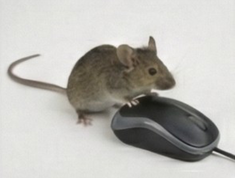</td>
<td>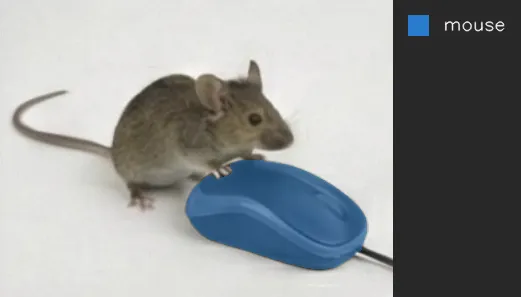</td>
<td>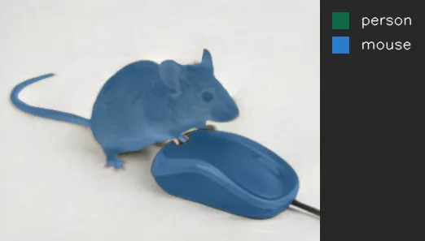</td>
</tr>
<tr>
<td></td>
<td>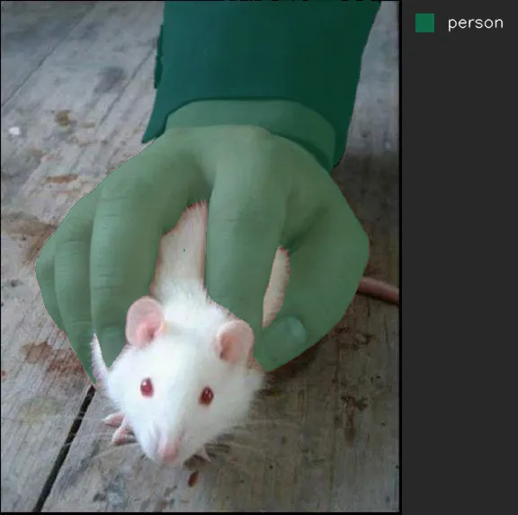</td>
<td>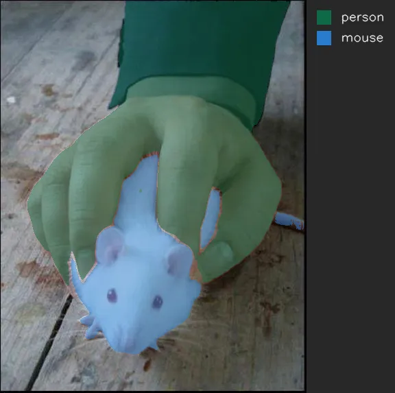</td>
</tr>
<tr>
<td></td>
<td>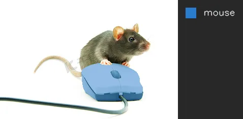</td>
<td></td>
</tr>
</table>
</div>

#### 2. Data Drift: Domain Adaptation

**Scenario:** Applying the model to **iSAID** (Remote Sensing), a domain with significant visual distribution shifts compared to natural scenes.
**Observation:**

* **Original SAM3:** Misses objects and hallucinates incorrect labels due to *Data Drift*.
* **ConceptBank (Ours):** Anchors to visual prototypes from the support set, successfully segmenting all planes without false positives.

<div align="center">
<table>
<tr>
<th width="20%">Input Image</th>
<th width="40%">ConceptBank (Ours) 


 <small><i>Robust Adaptation</i></small></th>
<th width="40%">Original SAM3 


 <small><i>Data Drift Failure</i></small></th>
</tr>
<tr>
<td></td>
<td>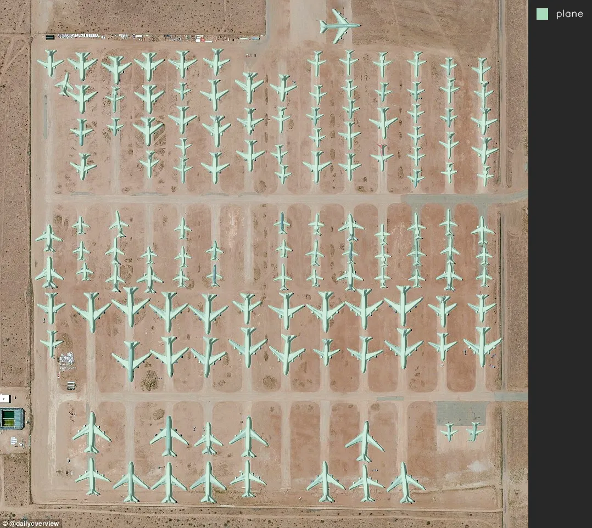</td>
<td>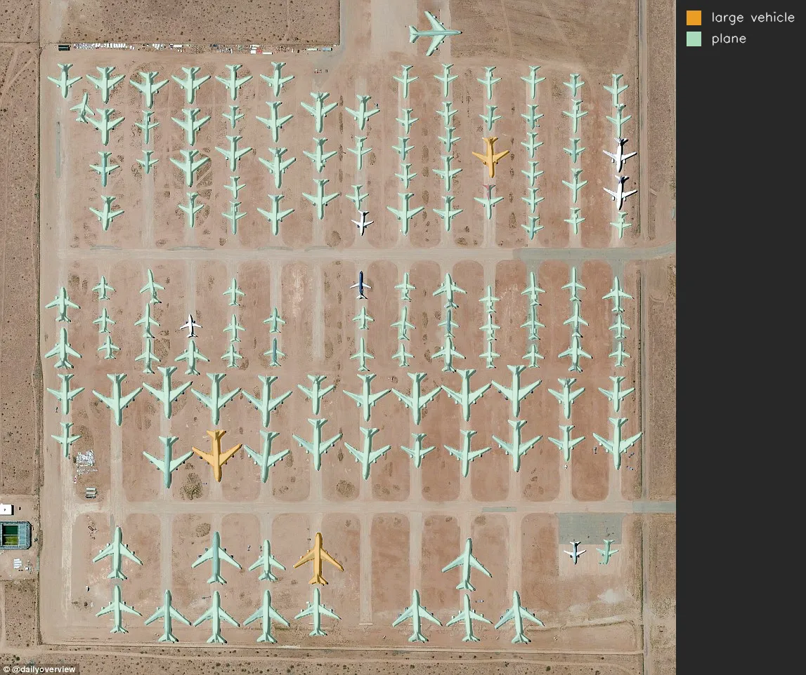</td>
</tr>
</table>
</div>

---

## I. Abstract

The recent introduction of **SAM3** has revolutionized Open-Vocabulary Segmentation (OVS) through *promptable concept segmentation*, which grounds pixel predictions in flexible concept prompts. However, this reliance on pre-defined concepts makes the model vulnerable: when visual distributions shift (*data drift*) or conditional label distributions evolve (*concept drift*) in the target domain, the alignment between visual evidence and prompts breaks down.

In this work, we present **ConceptBank**, a parameter-free calibration framework to restore this alignment on the fly. Instead of adhering to static prompts, we construct a dataset-specific concept bank from the target statistics. Our approach:

1. Anchors target-domain evidence via class-wise visual prototypes.
2. Mines representative supports to suppress outliers under data drift.
3. Fuses candidate concepts to rectify concept drift.

We demonstrate that **ConceptBank** effectively adapts SAM3 to distribution drifts, including challenging natural-scene and remote-sensing scenarios, establishing a new baseline for robustness and efficiency in OVS.

---

## II. Environment Preparation

This project relies on **PyTorch**, **MMSegmentation**, and the **SAM3** codebase.

### Requirements

* **Python:** 3.12 (Recommended)
* **CUDA:** 12.6

We strictly tested the code with the following library versions:

* `torch 2.9.1+cu126`
* `torchvision 0.24.1+cu126`
* `openmim 0.3.9`
* `mmengine 0.10.7`
* `mmcv 2.2.0` (Must be built from source)
* `mmsegmentation 1.2.2`

### Installation Steps

1. **Create a virtual environment:**

```bash
conda create -n cb4ovs python=3.12 -y
conda activate cb4ovs
```

2. **Install PyTorch:**

```bash
pip install torch==2.9.1+cu126 torchvision==0.24.1+cu126 --extra-index-url https://download.pytorch.org/whl/cu126
```

3. **Install MMLab Dependencies:**
Install basic tools:

```bash
pip install openmim==0.3.9
mim install mmengine==0.10.7
```

**Install MMCV (Build from Source):**
Since we use a specific PyTorch version, `mmcv` must be compiled from source to ensure CUDA operator compatibility.

> For more details, refer to the [MMCV Build Guide](https://mmcv.readthedocs.io/en/latest/get_started/build.html).

```bash
git clone https://github.com/open-mmlab/mmcv.git
cd mmcv
git checkout v2.2.0
# MMCV_WITH_OPS=1 ensures CUDA ops are compiled
MMCV_WITH_OPS=1 pip install -e .
cd ..
```

**Install MMSegmentation:**

```bash
mim install mmsegmentation==1.2.2
```

---

## III. Setup SAM3 & Checkpoints

Our method is based on SAM3. You must download the official SAM3 repository and weights.

1. **Clone SAM3:**
Download the SAM3 code and place the `sam3` folder in the root of this project.

```bash
# Ensure the folder is named 'sam3' and sits next to our scripts
git clone https://github.com/facebookresearch/sam3.git
```

2. **Download Checkpoints:**
Download `sam3.pt` from the [Hugging Face repository](https://huggingface.co/facebook/sam3).
Move the checkpoint to `sam3/assets/`.

```bash
# Move your downloaded sam3.pt here
mv path/to/sam3.pt sam3/assets/
```

---

## IV. Dataset Preparation

Please organize your datasets in a `data/` directory.

### Natural Scene Datasets

We evaluate on 8 benchmarks. Please follow the **MMSegmentation Dataset Preparation Guide** for standard datasets:

* [MMSegmentation Dataset Prepare](https://github.com/open-mmlab/mmsegmentation/blob/main/docs/en/user_guides/2_dataset_prepare.md)

**Note on COCO-Object:**
For the COCO-Object dataset conversion, we follow the format used in **SCLIP**. Please refer to their repository for the conversion scripts:

* [SCLIP GitHub](https://github.com/wangf3014/SCLIP)

### Remote Sensing Datasets

We evaluate on 4 benchmarks: `LoveDA`, `Potsdam`, `Vaihingen`, and `iSAID`. Ensure these are formatted compatibly with MMSegmentation conventions.

---

## V. Usage

We provide pre-constructed **Concept Banks** to facilitate direct reproduction of our results. These files are located in:

* `configs/concept_bank/cb_sam3_ns.pt` (for Natural Scene) [download](https://github.com/PGSmall/ConceptBank/releases/download/v0.1/cb_sam3_ns.pt)
* `configs/concept_bank/cb_sam3_rs.pt` (for Remote Sensing) [download](https://github.com/PGSmall/ConceptBank/releases/download/v0.1/cb_sam3_rs.pt)

You can use the provided scripts to evaluate these banks directly or regenerate them from scratch.

### Evaluation (Default)

By default, the scripts `cb4ovs_ns.sh` and `cb4ovs_rs.sh` are configured to **load the provided Concept Banks** and run the evaluation immediately.

**Natural Scene Evaluation:**

```bash
# Usage: bash cb4ovs_ns.sh [NGPUS] [LOGFILE]
bash cb4ovs_ns.sh 4 logs_ns.txt
```

**Remote Sensing Evaluation:**

```bash
# Usage: bash cb4ovs_rs.sh [NGPUS] [LOGFILE]
bash cb4ovs_rs.sh 4 logs_rs.txt
```

### Concept Bank Generation (Optional)

If you wish to **re-build the Concept Banks** from scratch (*e.g.*, to reproduce the generation process), simply **uncomment** the concept generation section (the `sam3_concept_bank.py` command) in the corresponding shell scripts (`cb4ovs_ns.sh` or `cb4ovs_rs.sh`) before running them.

### Gradio Demo

We provide a web-based demo for interactive testing.

**Install gradio:**
```bash
pip install gradio==6.2.0
```

**Concept Bank Demo:**
```bash
python app.py
```


---

## VI. Results

### Quantitative Results

We provide the quantitative comparison with state-of-the-art methods on both natural scene and remote sensing benchmarks.

**Natural Scene Benchmarks**

<div align="center">
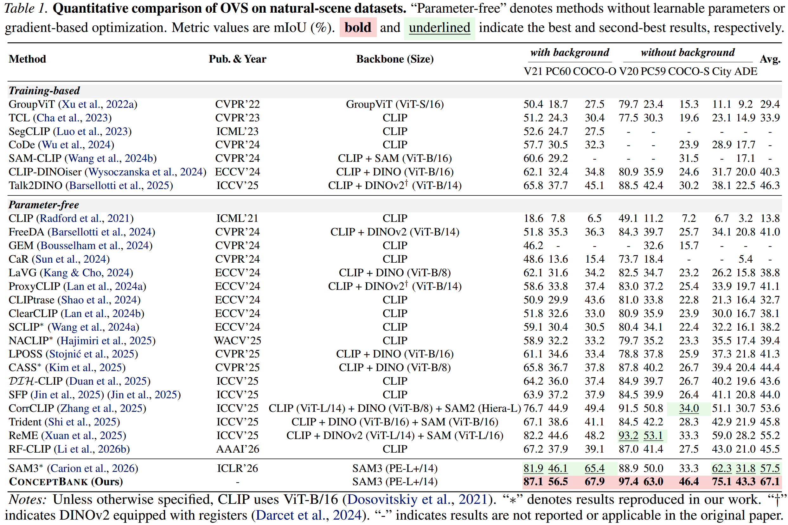
</div>


**Remote Sensing Benchmarks**

<div align="center">
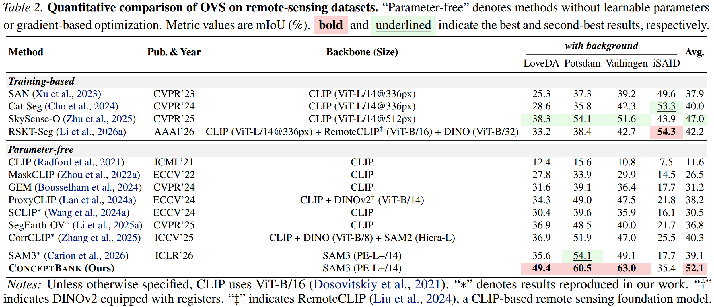
</div>

### Qualitative Visualization

**Natural Scene Visualization**

<div align="center">
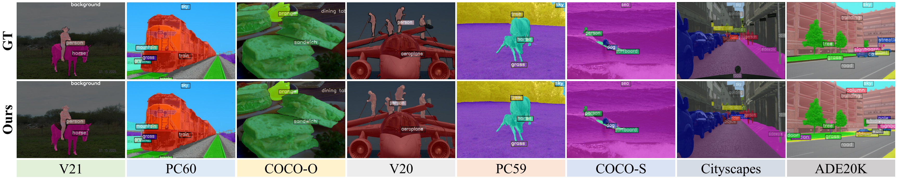
</div>


**Remote Sensing Visualization**

<div align="center">
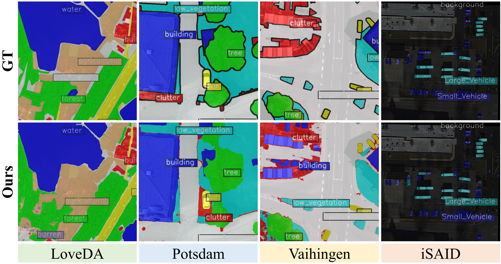
</div>

---

## VII. Acknowledgements

We explicitly thank the authors of the following excellent open-source projects, which were instrumental in this work:

* **SAM3:** [https://github.com/facebookresearch/sam3](https://github.com/facebookresearch/sam3)
* **SCLIP:** [https://github.com/wangf3014/SCLIP](https://github.com/wangf3014/SCLIP)
* **TCL:** [https://github.com/kakaobrain/tcl](https://github.com/kakaobrain/tcl)
* **GroupViT:** [https://github.com/NVlabs/GroupViT](https://github.com/NVlabs/GroupViT)
* **SegEarth-OV:** [https://github.com/likyoo/SegEarth-OV](https://github.com/likyoo/SegEarth-OV)
